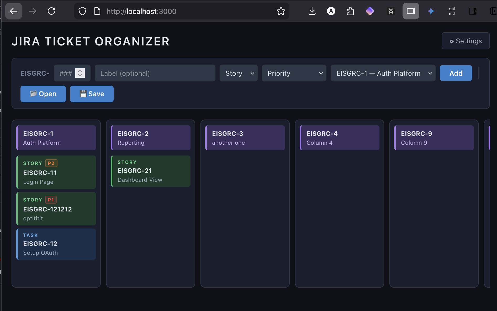

# Jira Ticket Organizer — User Manual



A local drag-and-drop board for organizing Jira tickets across EISGRC columns.
Runs entirely on your machine. No Jira login. No cloud. No accounts.

---

## Table of Contents

1. [Requirements](#requirements)
2. [Installation](#installation)
   - [macOS](#macos)
   - [Windows 11](#windows-11)
3. [Launching the App](#launching-the-app)
4. [Board Overview](#board-overview)
5. [Adding Tickets](#adding-tickets)
6. [Columns](#columns)
7. [Editing Tickets and Columns](#editing-tickets-and-columns)
8. [Deleting Tickets and Columns](#deleting-tickets-and-columns)
9. [Drag and Drop](#drag-and-drop)
10. [Priority Badges](#priority-badges)
11. [Moved Flag](#moved-flag)
12. [Saving and Sharing Boards](#saving-and-sharing-boards)
13. [Settings](#settings)
14. [Troubleshooting](#troubleshooting)

---

## Requirements

- **macOS** 12 or later, or **Windows 11**
- **Node.js 18+** (installed automatically by the setup scripts)
- A modern browser: Chrome, Firefox, Edge, or Safari

---

## Installation

### macOS

**Step 1 — Get the files**

Option A — Download ZIP (no Git required):
1. Go to https://github.com/autisticcaveman/jira-ticket-organizer
2. Click the green **Code** button → **Download ZIP**
3. Extract the ZIP to a folder (e.g. your Desktop or Documents)

Option B — Clone with Git:
```bash
git clone https://github.com/autisticcaveman/jira-ticket-organizer.git
```

---

**Step 2 — Run the installer**

Open **Terminal** (search for it in Spotlight with `⌘ Space`).

Navigate to the folder you extracted:
```bash
cd ~/Desktop/jira-ticket-organizer
```

Run the installer:
```bash
chmod +x install-mac.sh && ./install-mac.sh
```

The installer will:
- Check if Node.js is installed
- If not, install it automatically via Homebrew
- If Homebrew is also missing, it will give you a direct download link
- Install the app's dependencies (`npm install`)
- Make the launcher executable

> **If you see "Node.js not found" and no Homebrew:**
> Install Node.js from https://nodejs.org — download the macOS `.pkg` installer (LTS version),
> run it, then run `./install-mac.sh` again.

---

**Step 3 — Done**

You only need to run the installer once. After that, launch the app using `start-mac.command` (see [Launching the App](#launching-the-app)).

---

### Windows 11

**Step 1 — Get the files**

Option A — Download ZIP (no Git required):
1. Go to https://github.com/autisticcaveman/jira-ticket-organizer
2. Click the green **Code** button → **Download ZIP**
3. Right-click the ZIP → **Extract All** → choose a destination folder

Option B — Clone with Git:
```
git clone https://github.com/autisticcaveman/jira-ticket-organizer.git
```

---

**Step 2 — Run the installer**

Open the extracted folder and **double-click `install-windows.bat`**.

A terminal window will open. The installer will:
- Check if Node.js is installed
- If not, install it automatically via **winget** (built into Windows 11)
- Install the app's dependencies (`npm install`)

> **If Node.js installs but the next step fails immediately:**
> Close the window and double-click `install-windows.bat` again.
> Windows sometimes needs a fresh session to pick up the updated PATH after a new install.

> **If you see "winget is not available":**
> Install Node.js from https://nodejs.org — download the Windows `.msi` installer (LTS version),
> run it, then double-click `install-windows.bat` again.

---

**Step 3 — Done**

You only need to run the installer once. After that, launch the app using `start-windows.bat` (see [Launching the App](#launching-the-app)).

---

## Launching the App

### macOS
- **Double-click `start-mac.command`** in Finder

  > First time only: macOS may show a security warning ("can't be opened because it's from an
  > unidentified developer"). Right-click the file → **Open** → **Open**. This only needs to
  > happen once.

- The app will open automatically at **http://localhost:3000** in your default browser
- To stop the server: press `Ctrl+C` in the Terminal window, or close it

### Windows 11
- **Double-click `start-windows.bat`**
- The app will open automatically at **http://localhost:3000** in your default browser
- To stop the server: close the terminal window

> The app runs locally — nothing is sent to the internet. The server only runs while
> the terminal window is open.

---

## Board Overview


The board has three areas:

**1 — Add Ticket bar (top)**
Where you create new tickets. Contains fields for ticket number, label, type, priority, and target column, plus Open/Save buttons.

**2 — Board columns**
Each column represents one EISGRC item (purple header). Columns scroll horizontally. Tickets live inside columns and can be dragged between them.

**3 — Settings button (top right)**
Opens the Settings panel for theme and log management.

### Ticket types

| Color  | Type  | Meaning |
|--------|-------|---------|
| Green  | Story | A user-facing feature or requirement |
| Blue   | Task  | A technical task or sub-item |

### Column headers (purple)
Each column header shows the EISGRC item ID and name. Double-click to rename.

---

## Adding Tickets

Use the bar at the top of the page:

| Field | Description |
|-------|-------------|
| **EISGRC-** `###` | Enter the ticket number only (e.g. `11` → creates `EISGRC-11`) |
| **Label** | Optional description. If blank, the ticket ID is used as the label. |
| **Type** | Story (green) or Task (blue) |
| **Priority** | Optional: P1 Critical, P2 High, P3 Medium, P4 Low |
| **Column** | Which EISGRC column to add the ticket to |

Click **Add** or press **Enter** to create the ticket.

> Duplicate ticket IDs are rejected — you'll see an alert if the number already exists on the board.

---

## Columns

### Adding a column
Click the **+ Add Column** button at the far right of the board.
The new column opens immediately in edit mode — set the EISGRC ID and name, then click **Save**.

### Renaming a column
**Double-click** the purple column header. Edit the EISGRC number and name fields, then click **Save** or press **Enter**. Press **Escape** to cancel.

### Deleting a column
Hover over the column header — a **×** appears in the top-right corner.
Click it. A confirmation appears showing how many tickets will be lost.
Click **Yes** to confirm or **No** to cancel.

> Deleting a column permanently removes all tickets inside it.

---

## Editing Tickets and Columns

**Double-click** any ticket or column header to enter inline edit mode.

For tickets, you can edit:
- **EISGRC number** — the ticket ID suffix
- **Label** — the display name
- **Priority** — P1/P2/P3/P4 or none

Click **Save** (or press **Enter**) to apply. Click **Cancel** (or press **Escape**) to discard.

> The drag handle is suppressed while editing, so you can click and type in the fields normally.

---

## Deleting Tickets and Columns

**Hover** over a ticket or column header to reveal the **×** delete button in the top-right corner.

Clicking **×** shows an inline confirmation:
- For tickets: `Delete EISGRC-XX? Yes / No`
- For columns: `Delete EISGRC-X? (N tickets will be lost) Yes / No`

Click **Yes** to permanently delete. Click **No** to cancel.

---

## Drag and Drop

- **Within a column** — drag a ticket up or down to reorder it
- **Between columns** — drag a ticket left or right into a different column

Tickets follow the cursor in real time. The ghost image (semi-transparent) shows where it came from.

> Dragging a ticket to a different column will mark it with a **↗ moved** badge.
> See [Moved Flag](#moved-flag) below.

---

## Priority Badges

Tickets can have an optional priority badge displayed in the top-left of the card.

| Badge | Level    | Color  |
|-------|----------|--------|
| P1    | Critical | Red    |
| P2    | High     | Orange |
| P3    | Medium   | Yellow |
| P4    | Low      | Gray   |

**Set priority when adding:** Use the Priority dropdown in the add-ticket bar.

**Change priority:** Double-click the ticket → change the Priority dropdown → Save.

**Remove priority:** Double-click the ticket → set Priority to "— No Priority —" → Save.

Priority is saved in the board JSON and visible to anyone you share the file with.

---

## Moved Flag

When a ticket is dragged to a **different column**, it receives a teal **↗ moved** badge in the top-right of the card.

This flag:
- Persists across page refreshes (saved in localStorage)
- Is included in exported JSON files
- Is visible to anyone who opens your saved board file

**To acknowledge and clear the flag:** click the **↗ moved** badge directly. It disappears immediately.

### Why this exists
The typical workflow is:
1. You build the board and export it as a JSON file
2. Your manager/boss opens the file, reorganizes tickets across columns, and saves it back
3. You open their version — the moved badges show exactly which tickets they relocated

---

## Saving and Sharing Boards

### Auto-save
The board saves automatically to your browser's **localStorage** every time you make a change. It reloads exactly as you left it when you reopen the app.

### Manual export (Save)
Click **💾 Save** to download the current board as a `.json` file (named `jira-board-YYYY-MM-DD.json`).

Use this to:
- Share the board with someone else
- Keep a dated backup
- Send to your manager for review and re-prioritization

### Importing a board (Open)
Click **📂 Open** to load a `.json` board file.

This replaces the current board with the contents of the file. Your previous board is overwritten in localStorage (but any exported JSON files you saved are unaffected).

> **Sharing workflow:**
> 1. You → **💾 Save** → send file to boss
> 2. Boss runs the app, **📂 Open** → reorganizes → **💾 Save** → sends file back
> 3. You → **📂 Open** → see **↗ moved** badges on everything they relocated → acknowledge each one

---

## Settings

Click **⚙ Settings** (top right) to open the Settings panel.

### Display — Theme
Choose how the app looks:

| Option | Behavior |
|--------|----------|
| **Light** | Always light theme |
| **Dark** | Always dark theme |
| **System** | Follows your OS light/dark mode setting |

Theme is saved and restored on next open.

### App Logs
The app logs every board action (ticket add/edit/delete, column changes, file open/save) to daily log files stored in localStorage.

- Use the date selector to choose a day
- Log entries show timestamp, event type, and details
- Logs rotate automatically — only the 7 most recent days are kept

---

## Troubleshooting

**The app won't start / "command not found: npm"**
Node.js is not installed or not in your PATH. Re-run the installer (`install-mac.sh` or `install-windows.bat`). On Windows, close and reopen the terminal after Node installs.

**macOS: `start-mac.command` shows a security warning**
Right-click the file in Finder → **Open** → **Open**. This bypasses the Gatekeeper prompt. Only needed once.

**Windows: installer opens and closes immediately**
Right-click `install-windows.bat` → **Run as administrator**.

**Port 3000 is already in use**
Another process is using port 3000. On macOS:
```bash
lsof -ti :3000 | xargs kill -9
```
Then relaunch with `start-mac.command`.

On Windows: open Task Manager → find `node.exe` → End Task, then relaunch.

**Board loaded blank after rename/reinstall**
The app looks for saved data under the new key (`jira-board`) and also checks the old key (`eisgrc-board`) as a fallback. If both are empty, the board starts with sample data. Export your board before reinstalling to avoid data loss.

**Imported file shows "Invalid board file"**
The JSON file is malformed or not a board export. Only import files created by **💾 Save** from this app.

---

*Jira Ticket Organizer — https://github.com/autisticcaveman/jira-ticket-organizer*
